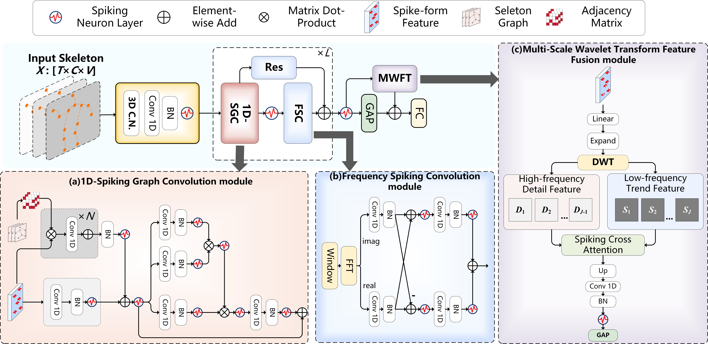

# Signal-SGN

**Signal-SGN: A Spiking Graph Convolutional Network for Skeleton Action Recognition via Learning Temporal-Frequency Dynamics**

This is the **official implementation** of the ACM MM ’25 paper *Signal-SGN: A Spiking Graph Convolutional Network for Skeleton Action Recognition via Learning Temporal-Frequency Dynamics*. The code is written in PyTorch with [SpikingJelly](https://github.com/fangwei123456/spikingjelly) and implements the **1D-SGC**, **FSC**, and **MWTF** modules described in the paper.

---

## Framework

Overall pipeline from the paper: **3D coordinate normalization** → **1D-SGC** (spiking graph convolution) → **FSC** (FFT + complex spiking convolution) → **MWTF** (multi-scale wavelet decomposition + spiking cross-attention) → **GAP + FC** classification.

<p align="center">
  
</p>

---

## Paper

- **Conference:** ACM MM ’25, Dublin, Ireland, October 27–31, 2025  
- **DOI:** [10.1145/3746027.3755246](https://doi.org/10.1145/3746027.3755246)  
- **Authors:** Naichuan Zheng, Yuchen Du, Hailun Xia<sup>*</sup>, Zeyu Liang — Beijing University of Posts and Telecommunications, School of Information and Communication Engineering  

<sup>*</sup> Corresponding author.

### Abstract

Graph Convolutional Networks (GCNs) are effective for skeleton-based action recognition but rely on floating-point computations and high energy use. Spiking Neural Networks (SNNs) are energy-efficient yet often struggle to model skeleton dynamics. **Signal-SGN** uses the **temporal dimension of skeleton sequences as spike time steps** and represents features as **multi-dimensional discrete stochastic signals** for **temporal–frequency** feature learning:

- **1D Spiking Graph Convolution (1D-SGC)** — spatial topology on skeleton graphs in the spiking domain.  
- **Frequency Spiking Convolution (FSC)** — FFT to the frequency domain and **complex** spiking convolution for frequency-aware features.  
- **Multi-Scale Wavelet Transform Feature Fusion (MWTF)** — discrete wavelet decomposition and **spiking cross-attention** to fuse multi-scale components, mitigating limitations of naive global average pooling over time.

Experiments on large-scale datasets show competitive accuracy vs. GCN methods with **lower theoretical energy** and strong results among SNN-based approaches.

---

## Method Overview

| Module | Role |
|--------|------|
| **3D Coordinate Normalization** | Per-channel normalization of joint coordinates to stabilize spiking-friendly inputs. |
| **1D-SGC** | Graph convolution + spiking dynamics along joints per time step. |
| **FSC** | FFT + complex-valued spiking convolution in the frequency domain. |
| **MWTF** | Multi-level DWT-style decomposition + fusion (see `module/dwt.py`). |
| **Classifier** | Temporal pooling and fully connected layer for class logits. |

Core model code: `model/signalgcn.py` · Wavelet / attention fusion: `module/dwt.py`

---

## Requirements

- Python ≥ 3.8  
- PyTorch (CUDA recommended for `spikingjelly` neuron backends)  
- [SpikingJelly](https://github.com/fangwei123456/spikingjelly)  
- See `requirements.txt` for full list (`scipy`, `sympy`, `einops`, `tensorboardX`, etc.)

**Note:** Neurons may use the **CuPy** backend when GPU is available. For CPU-only setups, set SpikingJelly neuron `backend='torch'` in code if needed.

### Recommended environment (example)

```bash
conda create -n vmamba python=3.10 -y
conda activate vmamba
pip install torch torchvision --index-url https://download.pytorch.org/whl/cu118   # or CPU wheel
pip install -r requirements.txt
```

---

## Data

Prepare skeleton datasets in the format expected by the feeders under `feeders/` (e.g. NTU RGB+D `.npz`, UCLA, UAV). Update paths in your YAML under `config/`.

Example placeholder in `config/default.yaml`:

```yaml
train_feeder_args:
  data_path: /path/to/NTU60_CS.npz
```

---

## Training

```bash
conda activate vmamba   # or your env
cd signal-sgn
python train.py --config config/default.yaml --device 0
```

- `--phase train` (default) or `test`  
- Adjust `work_dir`, `batch_size`, `num_epoch`, and dataset splits in the chosen YAML.

---

## Project layout

```
signal-sgn/
├── ALL.png           # Paper overall framework figure (used in README)
├── config/           # Dataset-specific YAML configs
├── feeders/          # Data loading for NTU / UCLA / UAV
├── graph/            # Skeleton graph definitions
├── model/
│   └── signalgcn.py  # Signal-SGN (1D-SGC + FSC + MWTF head)
├── module/
│   └── dwt.py        # MWTF (wavelet + fusion blocks)
├── train.py
├── requirements.txt
└── README.md
```

---

## Third-party code: wavelet / DWT utilities (`module/dwt.py`)

The **Legendre / Chebyshev multiwavelet filter construction** and related helpers in `module/dwt.py` (including `get_phi_psi`, `get_filter`, and normalizer utilities) follow the **Fourier Neural Operator (FNO)** reference implementation:

- Z. Li et al., *Fourier Neural Operator for Parametric Partial Differential Equations*, [arXiv:2010.08895](https://arxiv.org/abs/2010.08895)  
- Original code lineage: [zongyi-li/fourier_neural_operator](https://github.com/zongyi-li/fourier_neural_operator) (see in-file comment: *“taken from FNO paper”*).

These components are now maintained and extended in the broader **NeuralOperator** ecosystem ([neuraloperator/neuraloperator](https://github.com/neuraloperator/neuraloperator)), which is open-source and welcomes contributions. Signal-SGN **does not ship NeuralOperator as a dependency**; we only reuse a **small, adapted subset** of filter-building code for the MWTF branch. If you use this wavelet-filter part in academic work, please also cite NeuralOperator (and consider the FNO / survey references below), in addition to citing Signal-SGN.

**Citing NeuralOperator** (recommended if you reference the wavelet filter code):

```bibtex
@article{kossaifi2025librarylearningneuraloperators,
   author    = {Jean Kossaifi and
                  Nikola Kovachki and
                  Zongyi Li and
                  David Pitt and
                  Miguel Liu-Schiaffini and
                  Robert Joseph George and
                  Boris Bonev and
                  Kamyar Azizzadenesheli and
                  Julius Berner and
                  Valentin Duruisseaux and
                  Anima Anandkumar},
   title     = {A Library for Learning Neural Operators},
   journal   = {arXiv preprint arXiv:2412.10354},
   year      = {2025},
}
```

**Related (optional):**

```bibtex
@article{duruisseaux2025guide,
   author    = {Valentin Duruisseaux and
                  Jean Kossaifi and
                  Anima Anandkumar},
   title     = {Fourier Neural Operators Explained: A Practical Perspective},
   journal   = {arXiv preprint arXiv:2512.01421},
   year      = {2025},
}

@article{kovachki2023neuraloperator,
   author    = {Nikola Kovachki and
                  Zongyi Li and
                  Burigede Liu and
                  Kamyar Azizzadenesheli and
                  Kaushik Bhattacharya and
                  Andrew Stuart and
                  Anima Anandkumar},
   title     = {Neural Operator: Learning Maps Between Function Spaces with Applications to PDEs},
   journal   = {JMLR},
   volume    = {24},
   number    = {1},
   articleno = {89},
   numpages  = {97},
   year      = {2023},
}
```

> **Note:** MWTF-specific layers (`MultiWaveletTransform`, `MWT_CZ1d`, `CrossAttention`, etc.) are part of this repository’s Signal-SGN design; only the **spectral filter construction utilities** trace back to the FNO / NeuralOperator-style codebase.

---

## Citation

If you use this code or the method, please cite the MM ’25 paper:

```bibtex
@inproceedings{zheng2025signalsgn,
  title     = {Signal-{SGN}: A Spiking Graph Convolutional Network for Skeleton Action Recognition via Learning Temporal-Frequency Dynamics},
  author    = {Zheng, Naichuan and Du, Yuchen and Xia, Hailun and Liang, Zeyu},
  booktitle = {Proceedings of the 33rd ACM International Conference on Multimedia (MM '25)},
  year      = {2025},
  address   = {Dublin, Ireland},
  month     = {October},
  publisher = {ACM},
  doi       = {10.1145/3746027.3755246},
  url       = {https://doi.org/10.1145/3746027.3755246}
}
```

---

## License

Code is provided for research purposes. ACM publication rights apply to the paper; please respect the ACM copyright notice in the original article. For code reuse, add your own `LICENSE` file if you redistribute (e.g. MIT) after confirming compliance with your institution and co-authors.

---

## Acknowledgements

- [SpikingJelly](https://github.com/fangwei123456/spikingjelly) for SNN building blocks.  
- [NeuralOperator](https://github.com/neuraloperator/neuraloperator) / **FNO** lineage for multiwavelet filter utilities used in `module/dwt.py` (see **Third-party code** above).  
- Skeleton recognition pipelines commonly follow ST-GCN–style data and graph conventions.
